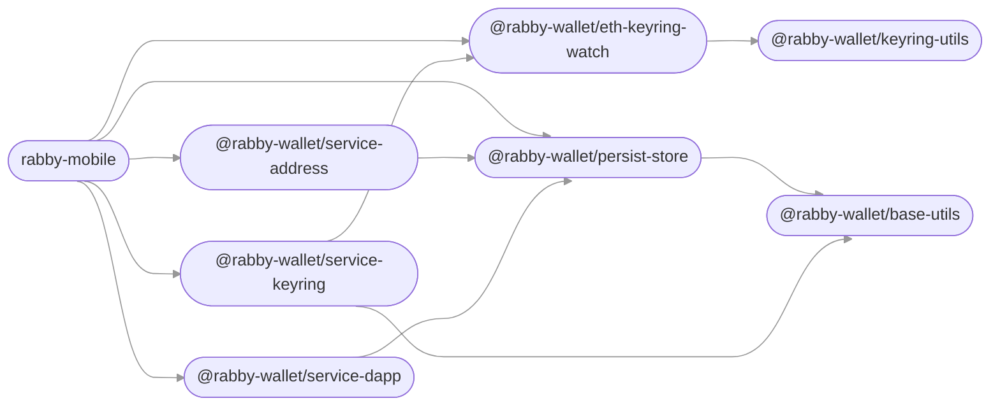

# Core Monorepo

This monorepo is a collection of packages used across multiple RabbyHub clients (e.g. [`Rabby`](https://github.com/RabbyHub/Rabby/), [`rabby-mobile`](https://github.com/RabbyHub/rabby-mobile/)).

## Modules

This repository contains the following packages [^fn1]:

<!-- start package list -->

- [`@rabby-wallet/base-utils`](packages/base-utils)
- [`@rabby-wallet/eth-keyring-watch`](packages/eth-keyring-watch)
- [`@rabby-wallet/keyring-utils`](packages/keyring-utils)
- [`@rabby-wallet/persist-store`](packages/persist-store)
- [`@rabby-wallet/service-address`](packages/service-address)
- [`@rabby-wallet/service-dapp`](packages/service-dapp)
- [`@rabby-wallet/service-keyring`](packages/service-keyring)
- [`rabby-mobile`](apps/mobile)

<!-- end package list -->

Or, in graph form [^fn1]:

<!-- start dependency graph -->

<!-- end dependency graph -->

Refer to individual packages for usage instructions.

## Learn more

For instructions on performing common development-related tasks, see [contributing to the monorepo](./docs/contributing.md).

[^fn1]: The package list and dependency graph should be programmatically generated by running `yarn update-readme-content`.
